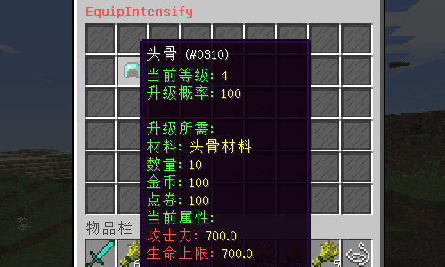
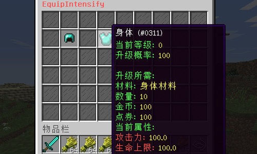
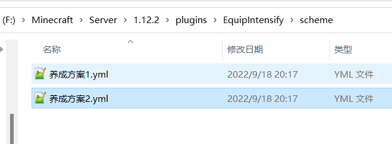
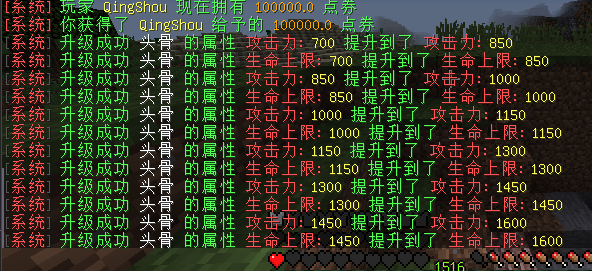
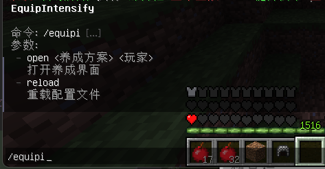

# EquipIntensify

### **适用版本**

> 1.12.2

### **依赖插件**

> - 必要: MythicMobs
> - 必要: SimpleLib (群内下载)
> - 可选: SX-Attribute 2.0.X
> - 可选: AttributePlus 2.0.X 3.0.X
> - 可选: ItemLoreOrigin

### **插件介绍**

> - 支持SQLite,MySQL存储
> - 兼容SX-Attribute,AttributePlus,ItemLoreOrigin 三款主流属性插件
> - 支持配置每个图鉴副本,副本内可以配置怪物组
> - GUI大部分支持自定义配置
> - 支持配置多GUI,每个GUI最多可配置54个养成物品
> - 支持Shift左右键快捷升级,配置文件可自定义不同点击方式升级数量
> - 通过MM物品判断升级材料
> - 可自定义每个养成物品的升级概率
> - 升级要求支持等级,金币,点券,MM物品

### **示例图片**

###### 养成示例


###### 多配置文件,多GUI

###### 升级提示

###### 插件指令


### **配置文件**

#### **养成方案示例(每个配置文件都是一个方案,独立的GUI)**
```yaml
Suit:
  套装A:
    equip:
      # 等级要求
      头骨: 50
      身体: 50
    Name: "§f套装A"
    Id: 403
    Data: 0
    Index: 8
    attribute:
      - "§a已生效套装属性: "
      - "§c攻击力: §e1000"
      - "§c生命上限: §e1000"
  套装B:
    equip:
      # 等级要求
      头骨: 20
      身体: 20
    Name: "§f套装B"
    Id: 403
    Data: 0
    Index: 8
    attribute:
      - "§a已生效套装属性: "
      - "§c攻击力: §e100"
      - "§c生命上限: §e100"
Equip:
  头骨:
    Name: "§f头骨"
    Id: 310
    Data: 0
    Lore:
      - "§a当前等级: §e%level%"
      - "§a升级概率: §e%probability%"
      - "§f"
      - "§a升级所需:"
      - "§a材料: §e%material%"
      - "§a数量: §e%amount%"
      - "§a金币: §e%money%"
      - "§a点券: §e%point%"
      - "§a当前属性:"
    # 升级材料,填写MM物品代号
    material: "头骨材料"
    # 材料所需数量
    amount: 10
    # 升级所需金币
    money: 100
    # 升级所需点券
    point: 100
    # 升级成功的概率
    probability: 100
    # 显示在GUI的位置
    index: 10
    # 属性
    attribute:
      "§c攻击力: §e":
        # 初始值
        default: 100
        # 每次升级提升的值
        upgrade: 150
      "§c生命上限: §e":
        # 初始值
        default: 100
        # 每次升级提升的值
        upgrade: 150
  身体:
    Name: "§f身体"
    Id: 311
    Data: 0
    Lore:
      - "§a当前等级: §e%level%"
      - "§a升级概率: §e%probability%"
      - "§f"
      - "§a升级所需:"
      - "§a材料: §e%material%"
      - "§a数量: §e%amount%"
      - "§a金币: §e%money%"
      - "§a点券: §e%point%"
      - "§a当前属性:"
    # 升级材料,填写MM物品代号
    material: "身体材料"
    # 材料所需数量
    amount: 10
    # 升级所需金币
    money: 100
    # 升级所需点券
    point: 100
    # 升级成功的概率
    probability: 100
    # 显示在GUI的位置
    index: 12
    # 属性
    attribute:
      "§c攻击力: §e":
        # 初始值
        default: 100
        # 每次升级提升的值
        upgrade: 150
      "§c生命上限: §e":
        # 初始值
        default: 100
        # 每次升级提升的值
        upgrade: 150
Gui:
  # Gui标题
  Title: "§c§lEquipIntensify"
  # Gui大小 9的倍数(9,18,27,36,45,54)
  Size: 54
  Item:
    # 复制粘贴可按照此格式添加更多物品来自定义GUI
    decorate:
      Name: "§f玻璃板"
      Id: 160
      Data: 15
      Lore:
        - " "
      # 该物品的位子
      Index:
        - 0
        - 1
        - 2
        - 3
        - 4
        - 5
        - 6
        - 7
        - 8
        - 9
    decorate2:
      Name: "§f玻璃板"
      Id: 160
      Data: 15
      Lore:
        - " "
      # 该物品的位子
      Index:
        - 10
        - 11
        - 12
        - 13
        - 14
        - 15
        - 16
        - 17
        - 18
        - 19
        - 20
        - 21
        - 22
        - 23
        - 24
        - 25
        - 26
        - 27
        - 28
        - 29
        - 30
        - 31
        - 32
        - 33
        - 34
        - 35
        - 36
        - 37
        - 38
        - 39
        - 40
        - 41
        - 42
        - 43
        - 44
        - 45
        - 46
        - 47
        - 48
        - 49
        - 50
        - 51
        - 52
        - 53
```
#### **config.yml**
```yaml
Config:
  # 您的授权码
  Code: "IKUN-JNTM-SZ666-SUSHAN"
  # 是否使用MySQL
  # false使用SQLite，true使用MySQL
  # 数据库连接配置请在插件 SimpleLib 配置文件中配置
  MySQL: false
  ClickType:
    # 左键键 + Shift升级: 次数
    LeftShift: 16
    # 右键 + Shift升级: 次数
    RightShift: 64
  Probability:
    概率材料1:
      # mm物品名
      mm: "概率材料1"
      # 提升的概率
      probability: 20
    概率材料2:
      mm: "概率材料2"
      probability: 50
Message:
  reload: "§a配置文件重载成功"
  permission_false: "§a您的权限不够"
  material_null: "§e{0} §a设置的升级材料有误,请联系管理员"
  material_false: "§a您没有升级所需的材料"
  money_false: "§a您的金币数量未达到升级要求"
  point_false: "§a您的点券数量未达到升级要求"
  sxd_false: "§a您的属性点数量未达到升级要求"
  online_false: "§a玩家 §e{0} §a不在线"
  upgrade_true: "§a升级成功 §e{0} §a的属性 §e{1} §a提升到了 §e{2}"
  upgrade_false: "§a升级失败"
```