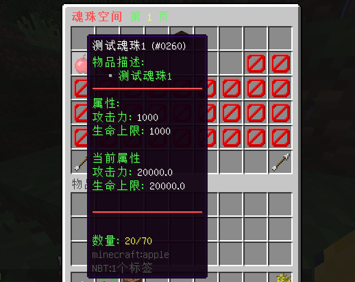
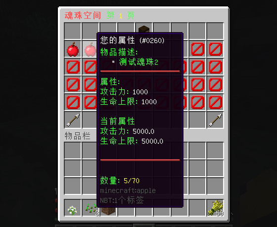
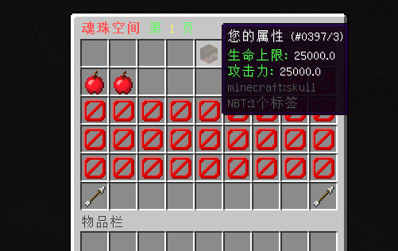
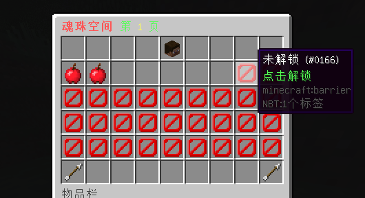
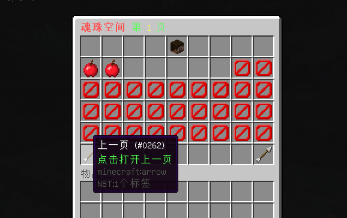
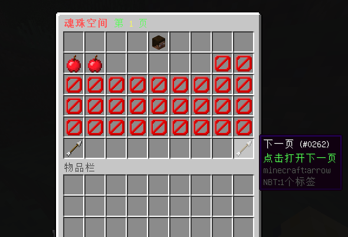
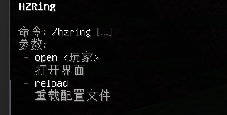

# HZRing

### **适用版本**

> 1.12.2

### **依赖插件**

> - 必要: MythicMobs
> - 必要: SimpleLib (群内下载)
> - 可选: SX-Attribute 2.0.X
> - 可选: AttributePlus 2.0.X 3.0.X
> - 可选: ItemLoreOrigin

### **插件介绍**

> - 支持SQLite,MySQL存储
> - 兼容SX-Attribute,AttributePlus,ItemLoreOrigin 三款主流属性插件
> - GUI支持槽位解锁,GUI翻页,每页最多可放入36种魂珠
> - 每种魂珠可设置不同权限可放入的魂珠数量
> - 可显示单个数量魂珠属性,当前数量魂珠属性,玩家所有魂珠共计属性

### **示例图片**

###### 魂珠演示




###### 属性统计



###### 槽位解锁



###### GUI翻页




###### 插件指令



### **配置文件**

#### **养成方案示例(每个配置文件都是一个方案,独立的GUI)**

```yaml
Gui:
# 戒指,填写mm物品名
Ring: "戒指"
# 解锁材料,填写mm物品名
Unlock: "解锁材料"
Item:
  测试魂珠1:
    Name: "§f测试魂珠1"
    Id: 260
    Data: 0
    Lore:
      - "§a物品描述:"
      - "   §7▪ §a测试魂珠1"
      - "§c§m                    "
      - "§a属性:"
      - "§a%attribute%"
      - "§a当前属性"
      - "%attribute_total%"
      - "§c§m                    "
      - "§f "
      - "§a数量: §e%amount%/%volume%"
    # mm 物品
    mm: "测试魂珠1"
    attribute:
      - "§a攻击力: §f1000"
      - "§a生命上限: §f1000"
    # 存储容量
    volume:
      default: 10
      # 拥有权限额外叠加容量,拥有多个权限将叠加多个
      permission:
        - "vip.vip1:10"
        - "vip.vip2:20"
        - "vip.vip3:30"
  测试魂珠2:
    Name: "§f您的属性"
    Id: 260
    Data: 0
    Lore:
      - "§a物品描述:"
      - "   §7▪ §a测试魂珠2"
      - "§c§m                    "
      - "§a属性:"
      - "§a%attribute%"
      - "§a当前属性"
      - "%attribute_total%"
      - "§c§m                    "
      - "§f "
      - "§a数量: §e%amount%/%volume%"
    # mm 物品
    mm: "测试魂珠2"
    attribute:
      - "§a攻击力: §f1000"
      - "§a生命上限: §f1000"
    # 存储容量
    volume:
      default: 10
      # 拥有权限额外叠加容量,拥有多个权限将叠加多个
      permission:
        - "vip.vip1:10"
        - "vip.vip2:20"
        - "vip.vip3:30"
```

#### **config.yml**

```yaml
Config:
  # 您的授权码
  Code: "IKUN-JNTM-SZ666-SUSHAN"
  # 是否使用MySQL
  # false使用SQLite，true使用MySQL
  # 数据库连接配置请在插件 SimpleLib 配置文件中配置
  MySQL: false
  Gui:
    Title: "§c§l魂珠空间 §a第 §e{0} §a页"
    # 魂珠增加的lore
    Item:
      Lore:
        - " "
        - "§a数量: §e%amount%"
    # 属性显示
    Attribute:
      Name: "§f您的属性"
      Id: 397
      Data: 3
      Lore:
        - "§a当前属性: "
      Attribute: "§a%attribute%: §e%value%"
    # 未解锁
    Lock:
      Name: "§f未解锁"
      Id: 166
      Data: 0
      Lore:
        - "§a点击解锁"
    # 上一页
    PageUp:
      Name: "§f上一页"
      Id: 262
      Data: 0
      Lore:
        - "§a点击打开上一页"
    # 下一页
    PageDown:
      Name: "§f下一页"
      Id: 262
      Data: 0
      Lore:
        - "§a点击打开下一页"
Message:
  reload: "§a配置文件重载成功"
  permission_false: "§a您的权限不够"
  online_false: "§a玩家 §e{0} §a不在线"
  pagedown_false: "§a请把这页解锁完成才能解锁下一页."
  pageup_false: "§a这已经是第一页了."
  unlock_true: "§a解锁成功."
  unlock_false: "§a解锁材料不够."
  add_false: "§a空间已满,请解锁更多的槽位"
  add_page: "§a请到第 §e{0} §a页存储该物品"
  item_false: "§a该物品不能放入空间内"
  item_limit: "§a该物品的存储数量已上限"
```