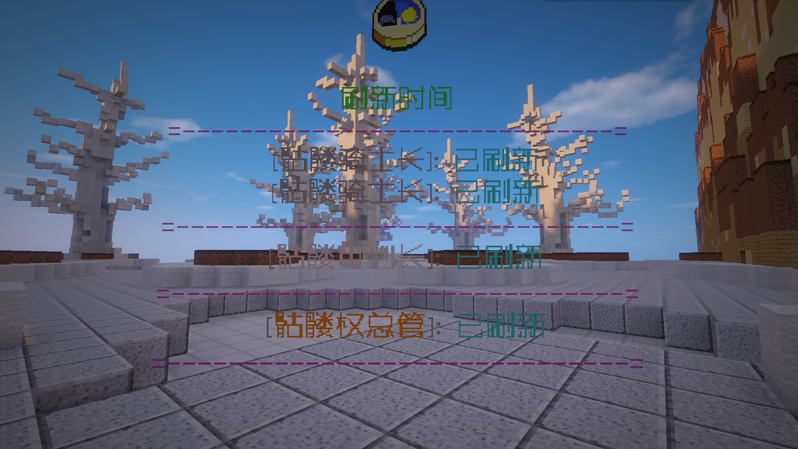

# MMShow

### **适用版本**

> 1.12.2

### **依赖插件**

> - 必要: MythicMobs
> - 必要: SimpleLib (群内下载)

### **插件介绍**
> - 因为是变量,所以可以在任何支持变量的地方显示倒计时
> - 支持MythicMobs怪物刷新点的Cooldown和Warmup倒计时
> - 支持以秒,分,时为单位显示

### **示例图片**

###### 全息显示



### **配置文件**
#### **config.yml**

```yaml
# 变量
# 单位类型: s 秒,m 分钟, h 小时
# 显示怪物 warmup 倒计时 %mmshow_warmup_怪物生成点_单位类型%
# 显示怪物 cooldown 倒计时 %mmshow_cooldown_怪物生成点_单位类型%
Config:
  # 您的授权码
  Code: "IKUN-JNTM-SZ666-SUSHAN"
Message:
  reload: "§a配置文件重载成功"
  online_false: "§a玩家 §e{0} §a不在线"
  spawner_true: "已刷新"
  cooldown_true: "生成冷却中"
  warmup_true: "处于准备状态"
  spawner_null: "怪物未找到"
  spawner_error: "该怪物不使用倒计时"
  error: "出错"
```