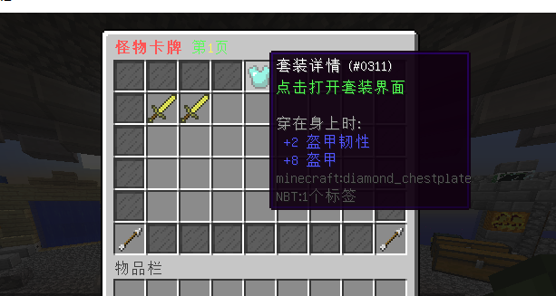
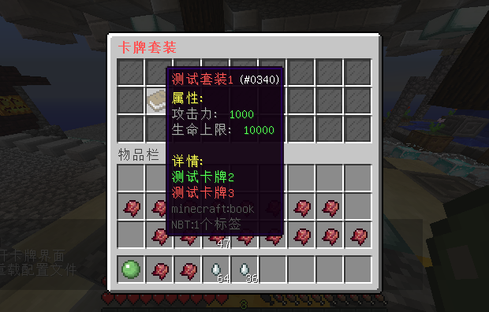

# MonsterCard

### **适用版本**

> 1.12.2

### **依赖插件**

> - 必要: MythicMobs
> - 必要: SimpleLib (群内下载)
> - 可选: SX-Attribute 2.0.X
> - 可选: AttributePlus 2.0.X 3.0.X
> - 可选: ItemLoreOrigin

### **插件介绍**

> - 支持Yaml,MySQL存储
> - 配置文件配置卡牌列表(MM物品名)
> - 玩家通过mm物品给予指令获得该卡牌后手持右键即可
> - 属性根据MM物品的Lore所生效
> - 激活卡牌所激活的卡牌开源在插件GUI中查看
> - 卡牌GUI支持翻页,以及部分自定义
> - 支持卡牌套装

### **示例图片**

###### 卡牌演示

###### 卡牌套装



###### **配置文件**

```yaml
Config:
  Code: "授权码"
  # MySQL请在插件 SimpleLib 中配置
  MySQL: false
  # 卡牌
  Cards:
    - "测试卡牌"
    - "测试卡牌2"
    - "测试卡牌3"
  # 套装

  Gui:
    Title: "§c§l怪物卡牌 §a第§e%page%§a页"
    # 填充物品
    Decorate:
      Name: "§f玻璃板"
      Id: 160
      Data: 15
      Lore:
        - " "
    # 套装
    Suit:
      Name: "§f套装详情"
      Id: 311
      Data: 0
      Lore:
        - "§a点击打开套装界面"
    # 上一页
    PageUp:
      Name: "§f上一页"
      Id: 262
      Data: 0
      Lore:
        - "§a点击打开上一页"
    # 下一页
    PageDown:
      Name: "§f下一页"
      Id: 262
      Data: 0
      Lore:
        - "§a点击打开下一页"
Message:
  prefix: "§8[§e怪物卡牌§8] "
  reload: "§a配置文件重载成功"
  permission_false: "§a您的权限不够"
  stats_true: "§a已激活"
  pagedown_false: "§a这已经是最后一页了."
  pageup_false: "§a这已经是第一页了."
  card_true: "§a卡牌 §e%card% §a已成功激活."
  card_false: "§a您已经激活过这个卡牌了."
  attribute_true: "§a怪物卡牌属性生效成功."
  Help:
    - "§f "
    - "§f   §8 §8[§e怪物卡牌§8]    "
    - "§a/gwkp open §f打开卡牌界面"
    - "§a/gwkp reload §f重载配置文件"
    - "§f "
```