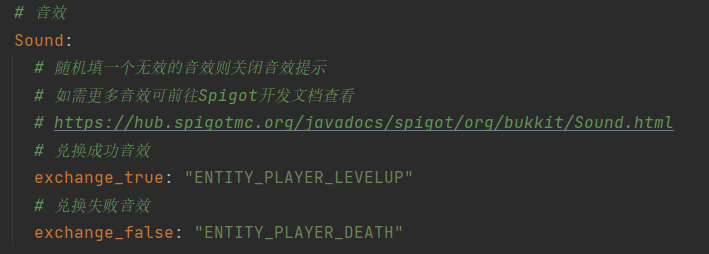
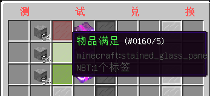
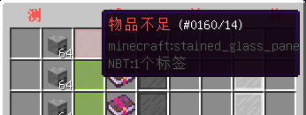
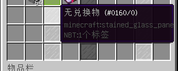
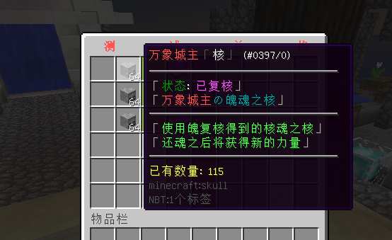
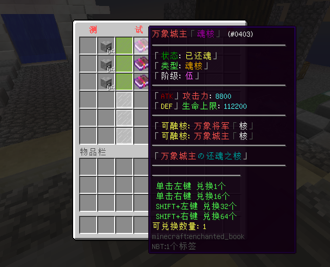
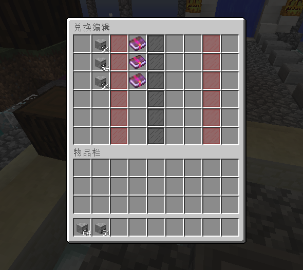

## KLRingExchange

### **适用版本**

> 1.12.2

### **依赖插件**

> - KLRing

### **插件介绍**

本插件为KLRing(灵魂空间)附属  
消耗灵魂空间内的物品兑换到背包  
此版本为重制版，功能更加强大，同时兼容老的数据

#### 配置文件高度自定义

> - 兑换状态的模板
> - 显示已有物品数量的模板
> - 显示可兑换数量的模板
> - 中间装饰板模板
> - 每个兑换GUI的标题
> - 兑换音效
> - 玩家和管理员指令的Help
> - 插件的所有提示

#### 兑换成功和失败均支持音效



#### 支持显示当前兑换状态







#### 支持显示所需物品在灵魂空间的当前数量



#### 可显示可兑换数量以及不同点击方式兑换数量



#### 高效的兑换编辑界面，物品放到对应位置即可，关闭GUI自动保存



### **配置文件**

```yaml
Message:
  prefix: "§8[§e灵魂空间兑换§8] "
  reload: "§a配置文件重载成功"
  permission_false: "§a您的权限不够"
  exchange_length: "§a请输入兑换名"
  exchange_null: "§a兑换界面 §e{0} §a不存在"
  exchange_create: "§a兑换界面 §e{0} §a不存在,已自动创建"
  editor_true: "§a兑换界面 §e{0} §a编辑成功"
  amount_false: "§a物品数量不足以兑换"
  exchange_true: "§a兑换成功"
  residue_false: "§a请给背包预留足够空间"
  PlayerHelp:
    - "§f "
    - "§f   §8 §8[§e灵魂空间兑换§8]    "
    - "§a/klre open 兑换名 §f打开兑换界面"
    - "§f "
  AdminHelp:
    - "§f "
    - "§f   §8 §8[§e灵魂空间兑换§8]    "
    - "§a/klre open 兑换名 §f打开兑换界面"
    - "§a/klre edit 兑换名 §f编辑兑换界面"
    - "§a/klre reload §f重载配置文件"
    - "§f "
Config:
  # 您的授权码
  Code: "IKUN-JNTM-SZ666-SUSHAN"
  # 兑换时背包最少剩余空间
  InventoryResidue: 4
  # 以下禁止为0
  # 左键兑换数量
  Left: 1
  # 右键兑换数量
  Right: 16
  # 左键+Shift兑换数量
  LeftShift: 32
  # 右键+Shift兑换数量
  RightShift: 64
  # 音效
  Sound:
    # 随机填一个无效的音效则关闭音效提示
    # 如需更多音效可前往Spigot开发文档查看
    # https://hub.spigotmc.org/javadocs/spigot/org/bukkit/Sound.html
    # 兑换成功音效
    exchange_true: "ENTITY_PLAYER_LEVELUP"
    # 兑换失败音效
    exchange_false: "ENTITY_PLAYER_DEATH"
Gui:
  # 默认兑换标题
  DefaultTitle: "§c灵魂空间兑换,可在对应GUI配置文件进行修改"
  Amount:
    - "§e已有数量: %amount%"
  ExchangeInfo:
    - "§7§m                      "
    - "§a 单击左键 兑换1个"
    - "§a 单击右键 兑换16个"
    - '§a SHIFT+左键 兑换32个'
    - '§a SHIFT+右键 兑换64个'
    - "§e可兑换数量: %amount%"
  Item:
    # 物品满足时显示
    exchange_true:
      Id: 160
      Data: 5
      Name: "§a物品满足"
      Lore: [ ]
    # 物品不足时显示
    exchange_false:
      Id: 160
      Data: 14
      Name: "§c物品不足"
      Lore: [ ]
    # 无兑换物时显示
    exchange_null:
      Id: 160
      Data: 0
      Name: "§7无兑换物"
      Lore: [ ]
    # 中间装饰板
    decorate:
      Id: 160
      Data: 15
      Name: ""
      Lore: [ ]
```