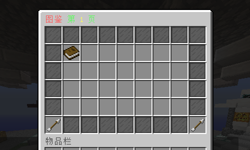
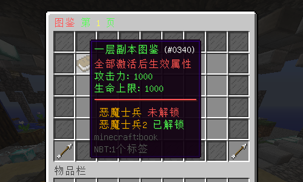
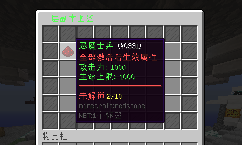
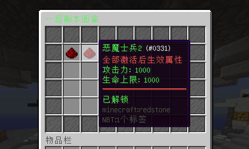

# MonsterManual

### **适用版本**

> 1.12.2

### **依赖插件**

> - 必要: MythicMobs
> - 必要: SimpleLib (群内下载)
> - 可选: SX-Attribute 2.0.X
> - 可选: AttributePlus 2.0.X 3.0.X
> - 可选: ItemLoreOrigin

### **插件介绍**

> - 支持Yaml,MySQL存储
> - 支持配置每个图鉴副本,副本内可以配置怪物组
> - GUI大部分支持自定义配置
> - 图鉴首页支持翻页
> - 图鉴首页可显示当前图鉴副本内的所有组的解锁状态
> - 每个怪物组内所有击杀怪物达到所需数量即可解锁该怪物组
> - 怪物组未解锁时可显示解锁进度
> - 怪物组解锁后可领取奖励,生效当前怪物组的属性
> - 当图鉴副本内的所有怪物组解锁完成后可以生效图鉴副本的属性
> - 可使用指令让玩家解锁指定图鉴副本内的指定怪物组

### **示例图片**

###### 图鉴首页示例




###### 怪物组-未解锁



###### 怪物组-已解锁



### **配置文件**

#### **副本示例(一个配置文件一个副本)**

```yaml
Title: "§a一层副本图鉴"
Button:
  Name: "§a一层副本图鉴"
  Id: 340
  Data: 0
  Lore:
    - "§c全部激活后生效属性"
    - "§a攻击力: 1000"
    - "§a生命上限: 1000"
    - "&c&m                     "
# 全部激活后的奖励
Reward:
  - "mm i give %player% 测试符文"
  - "mm i give %player% 测试符文"
# 全部激活后的属性
Attribute:
  - "§a攻击力: 1000"
  - "§a生命上限: 1000"
Mobs:
  # mm 怪物代号
  恶魔士兵:
    Name: "§a恶魔士兵"
    Id: 331
    Data: 0
    Lore:
      - "§c全部激活后生效属性"
      - "§a攻击力: 1000"
      - "§a生命上限: 1000"
      - "&c&m                     "
      - "%state% "
    # 图鉴怪物列表(可多只)
    List:
      - "恶魔士兵2"
    # 列表内怪物击杀数量
    Amount: 10
    # 奖励
    Reward:
      - "mm i give %player% 测试符文"
      - "mm i give %player% 测试符文"
    # 生效属性
    Attribute:
      - "§a攻击力: 1000"
      - "§a生命上限: 1000"
  恶魔士兵2:
    Name: "§a恶魔士兵2"
    Id: 331
    Data: 0
    Lore:
      - "§c全部激活后生效属性"
      - "§a攻击力: 1000"
      - "§a生命上限: 1000"
      - "&c&m                     "
      - "%state% "
    # 图鉴怪物列表(可多只)
    List:
      - "恶魔士兵2"
    # 列表内怪物击杀数量
    Amount: 10
    # 奖励
    Reward:
      - "mm i give %player% 测试符文"
      - "mm i give %player% 测试符文"
    # 生效属性
    Attribute:
      - "§a攻击力: 1000"
      - "§a生命上限: 1000"


```

#### **config.yml**

```yaml
Config:
  # 您的授权码
  Code: "IKUN-JNTM-SZ666-SUSHAN"
  # 数据库
  MySQL:
    # 开关
    enable: false
    ip: "192.168.0.188"
    port: "3306"
    # 数据库名字
    database: "mc"
    user: "mc"
    password: "mc"
  # 生效的图鉴列表
  Manual:
    - "一层副本"
  Gui:
    Title: "§c图鉴 §a第 §e%page% §a页"
    # %mob% 变量显示怪物名字
    All_Unlock: "§a全部解锁"
    Unlock_true: "§6 %mob% §a已解锁"
    Unlock_false: "§6 %mob% §c未解锁"
    # 填充物品
    Decorate:
      Name: "§f玻璃板"
      Id: 160
      Data: 15
      Lore:
        - " "
    # 上一页
    PageUp:
      Name: "§f上一页"
      Id: 262
      Data: 0
      Lore:
        - "§a点击打开上一页"
    # 下一页
    PageDown:
      Name: "§f下一页"
      Id: 262
      Data: 0
      Lore:
        - "§a点击打开下一页"
Message:
  prefix: "§8[§e怪物图鉴§8] "
  state_unlock: "§a已解锁"
  state_reward: "§c可领取"
  state_false: "§c未解锁：§e%current%/%total%"
  msg_state_true: "§c奖励领取成功"
  msg_state_false: "§c您的击杀数量未达到，不可领取"
  reload: "§a配置文件重载成功."
  pagedown_false: "§a这已经是最后一页了."
  pageup_false: "§a这已经是第一页了."
  permission_false: "§a您的权限不够."
  unlock_length: "§a请输入正确参数 §emanual unlock 玩家 副本 怪物"
  unlock_true: "§a玩家 §e{0} §a副本 §e{1} §a怪物 §e{2} §a解锁成功"
  Help:
    - "§f "
    - "§f   §8 §8[§e怪物图鉴§8]    "
    - "§a/manual open §f打开图鉴"
    - "§a/manual unlock 玩家 副本 怪物 §f解锁玩家图鉴"
    - "§a/manual reload §f重载配置文件"
    - "§f "
```