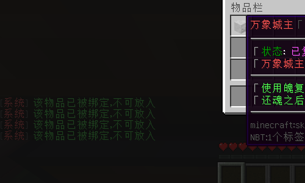
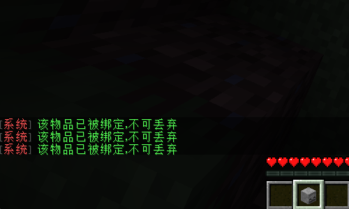
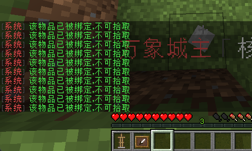
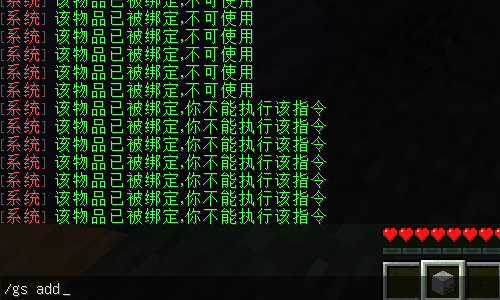
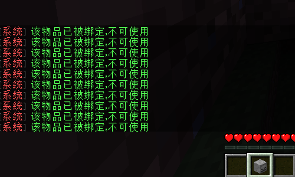
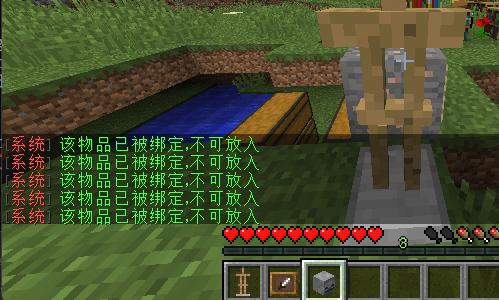
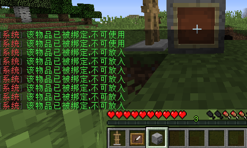

# NoTrade

### **适用版本**

> 1.12.2

### **依赖插件**
> - 必要: SimpleLib (群内下载)

### **插件介绍**

> - 判断物品的Lore或者是Name限制一切可交易的渠道
> - 可在配置文件开启或关闭指定限制
> - 自定义指定权限可绕过所有限制

### **示例图片**

###### GUI限制

###### 丢弃限制

###### 拾取限制

###### 手持物品指令限制

###### 交互限制

###### 盔甲架限制

###### 展示框限制


### **配置文件**

```yaml
Message:
  reload: "§a配置文件重载成功"
  debug: "§a当前GUI Title: §e{0}"
  invclick_false: "§a该物品已被绑定，不可放入"
  interact_false: "§a该物品已被绑定，不可使用"
  pickup_false: "§a该物品已被绑定，不可拾取"
  command_false: "§a该物品已被绑定，你不能执行该指令"
  drop_false: "§a该物品已被绑定，不可丢弃"
  frame_false: "§a品已被绑定，不可放入"
  armorstand_false: "§a品已被绑定，不可放入"
Config:
  # 您的授权码
  Code: "IKUN-JNTM-SZ666-SUSHAN"
  # 调试模式，会在后台输出GUI标题名字之类的数据
  Debug: false
  # Gui内点击事件
  InvClickEvent: true
  # 交互事件
  InteractEvent: true
  # 丢弃事件
  DropItemEvent: true
  # 拾取物品事件
  PickupItemEvent: true
  # 玩家输入指令事件
  CommandEvent: true
  # 禁止放入展示框
  FrameEvent: true
  # 禁止放入盔甲架
  ArmorStandEvent: true
  # 拥有一下任意权限将不受交易限制
  Permission:
    - "notrade.admin"
  # GUI黑名单，黑名单内的GUI受限制
  Title:
    # 箱子
    - "chest"
    # 漏斗
    - "hopper"
    # 信标
    - "beacon"
    # 附魔台
    - "enchant"
    # 铁砧
    - "repair"
    # 投掷器
    - "dropper"
    # 发射器
    - "dispenser"
    # 熔炉
    - "furnace"
  # 手持禁止交易物品禁止输入的指令
  Commands:
    - "gs"
  Name:
    - "测试Name1"
    - "测试Name2"
  Lore:
    - "测试Lore1"
    - "测试Lore2"
```